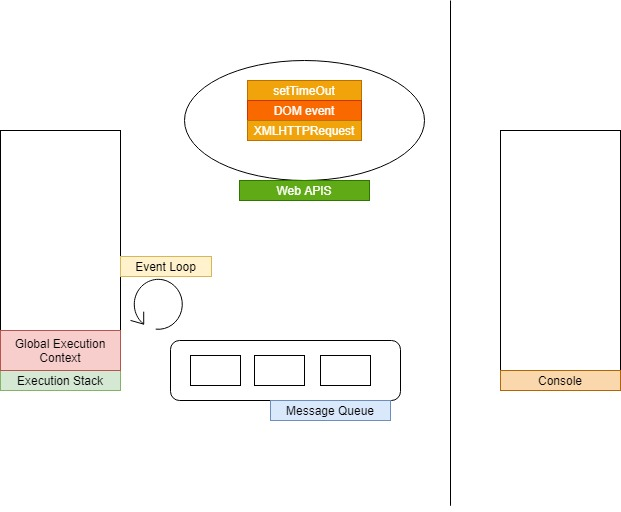
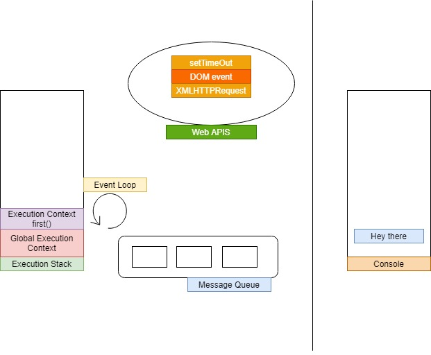
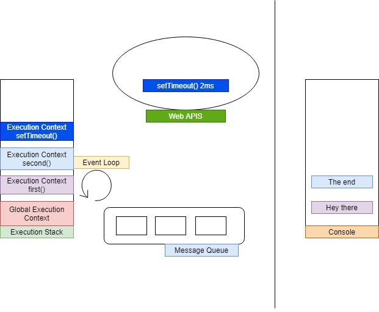
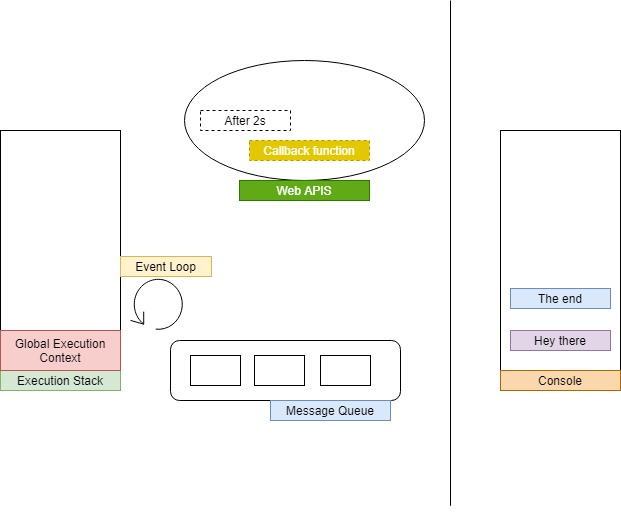
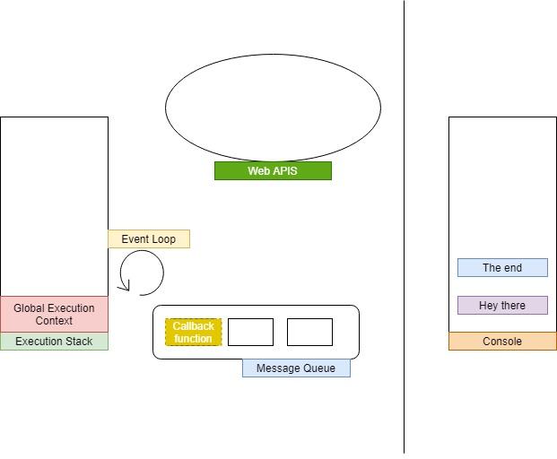
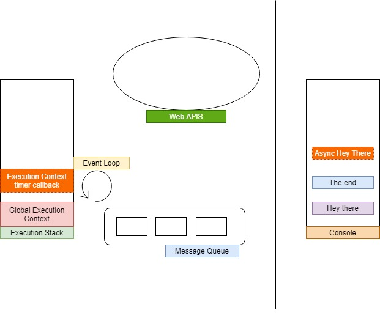

# JavaScript Notebook

## SYNCHRONOUS VS ASYNCHRONOUS

* Synchronous
    * line by line
    * execute after and after


* Asynchronous
    * Allow asynchronousfunctions to run in the "background"
    * We pass in callbacks that run once the functions has finished it's work
    * Move on immediately : Non-blocking!


## Asynchronous Execution Map.



``` js
const second = () => {
    setTimeout(() => {
        console.log('Async Hey There');
    }, 2000);
};

const first = ()=>{
    console.log('Hey there!');
    setTimeout();
    console.log('The end');
};

first();
```

## First Step:
#### Execute first function()



## Second Step:
#### Execute Asynchronous function **setTimeout** and wait 2s



## Third Step:
#### After 2s later, the callbalck function of setTimeout will move on message queue and Event lopp monitor the message queue and Execution stack. Event loop will push message as soon as the stack is empty.



